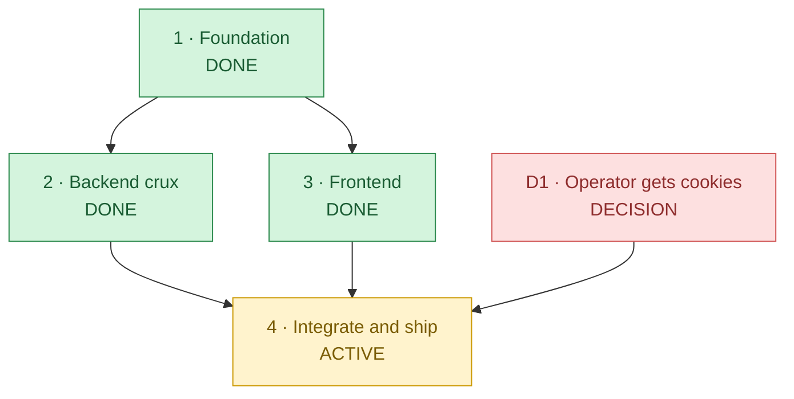

# Roadmap — gallery-dl-web

A two-service web app (FastAPI + Next.js) wrapping `gallery-dl` to download Instagram and Facebook
images with live SSE progress. See [the event contract](docs/event-contract.md) for the wire format.

## At a glance

| Phase | Status | What it is | Blocker |
|---|---|---|---|
| **1 · Foundation** | ✅ DONE | Public repo `lumduan/gallery-dl-web`; monorepo scaffold (backend from `python-template` + Next.js); both Dockerfiles; `.gitignore`/LICENSE/README; pinned SSE event contract (`docs/event-contract.md`) | — |
| **2 · Backend crux** | ✅ DONE | gallery-dl subprocess worker (STDIN config → JSON-lines hooks), asyncio `JobManager` (fan-out + history replay), SSE route, cookie store, settings/files/health routes; ruff/mypy clean, pytest **89.8%** coverage | — |
| **3 · Frontend** | ✅ DONE | Next.js pages: `/` (URL input + platform detect), `/jobs/[id]` (SSE progress + zip), `/settings` (cookies), `/downloads`; `EventSource` consumer; `next.config` rewrite. typecheck + lint + build green | — |
| **4 · Integrate and ship** | 🟡 ACTIVE | `docker-compose` (dev + prod); ghcr publish workflow; first release tag; live E2E verification | needs D1 for live E2E; otherwise just finishing the release |
| **D1 · Operator cookies** | 🟥 DECISION | Obtain a real IG `sessionid` + FB cookies.txt to verify end-to-end against a live URL | operator action, any time |

> **The only remaining bottleneck is OPERATOR ACTION (D1 — obtaining valid cookies) and TIME.** All
> build work (P1–P3) is done; P4 is finishing the release plumbing. The backend is fully unit-tested
> with a fake `DownloadJob` (no network needed), so it is verified regardless of D1; D1 only gates
> the optional live-network smoke test.

---

## Phase detail

### 1 · Foundation — ✅ DONE
Monorepo created from `lumduan/python-template` conventions (uv, src-layout, hatchling, py312, ruff,
mypy-strict, pytest ≥80%). Next.js 16 + Tailwind v4 + DaisyUI 5 frontend. Both Dockerfiles
(non-root UID 1001, HEALTHCHECK). SSE contract pinned so backend and frontend could proceed
independently.

### 2 · Backend crux — ✅ DONE
- `gallerydl/worker.py` — subprocess entry: reads JSON config from STDIN, runs gallery-dl's
  in-process API (`DownloadJob` + hooks), emits JSON-lines events; always emits a terminal event.
- `gallerydl/config_builder.py` — pure translator (job payload → `config.set` tree), highest-tested.
- `jobs/manager.py` — asyncio orchestrator: per-job subprocess, history-replay SSE fan-out,
  synthesized terminal on silent worker death, GC of old terminal jobs.
- `cookies/store.py` — single-account, 0600, Netscape parser, log masking.
- **Tests**: ruff clean, `mypy src` clean, 71 tests passing at 89.8% coverage (incl. a real
  worker-subprocess integration test).

### 3 · Frontend — ✅ DONE
- `next.config.ts` rewrites `/api/*` + `/health` → backend (CORS still configured for direct use).
- `JobProgress.tsx` consumes the SSE stream with typed listeners; renders a live activity log and
  per-file counts; surfaces a clear "missing-cookies → Settings" message.
- Cookie forms never display stored values (booleans only).

### 4 · Integrate and ship — 🟡 ACTIVE
- [x] `docker-compose.yml` (prod, ghcr images) + `docker-compose.dev.yml` (bind-mounts + reload)
- [x] GitHub Actions: `ci.yml` (backend + frontend quality), `docker-publish.yml` (ghcr on tag),
      `security.yml` (weekly bandit + pip-audit)
- [ ] `docker compose up` smoke test (requires D1 for a real download)
- [ ] tag `v0.1.0` → first ghcr publish

### D1 · Operator cookies — 🟥 DECISION
- IG: DevTools → Application → Cookies → copy `sessionid`.
- FB: export Netscape `cookies.txt` (use a burner account).

---

## Living-document rule

Any task that closes or materially advances a tracked item **must** reconcile this document —
including the at-a-glance diagram and the phase-status table — as part of its own completion, not as
a follow-up. This is the roadmap-specific instance of "keep durable planning docs current as part of
'done'."
