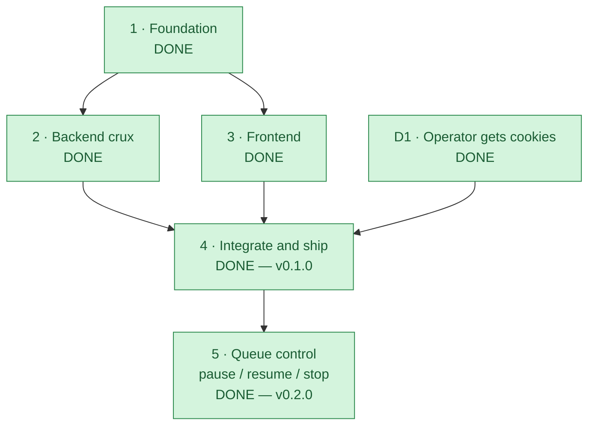

# Roadmap — gallery-dl-web

A two-service web app (FastAPI + Next.js) wrapping `gallery-dl` to download Instagram and Facebook
images with live SSE progress. See [the event contract](docs/event-contract.md) for the wire format.

## At a glance

| Phase | Status | What it is | Blocker |
|---|---|---|---|
| **1 · Foundation** | ✅ DONE | Public repo `lumduan/gallery-dl-web`; monorepo scaffold (backend from `python-template` + Next.js); both Dockerfiles; `.gitignore`/LICENSE/README; pinned SSE event contract (`docs/event-contract.md`) | — |
| **2 · Backend crux** | ✅ DONE | gallery-dl subprocess worker (STDIN config → JSON-lines hooks), asyncio `JobManager` (fan-out + history replay), SSE route, cookie store, settings/files/health routes; ruff/mypy clean, pytest **89.8%** coverage | — |
| **3 · Frontend** | ✅ DONE | Next.js pages: `/` (URL input + platform detect), `/jobs/[id]` (SSE progress + zip), `/settings` (cookies), `/downloads`; `EventSource` consumer; catch-all `/api/*` proxy route. typecheck + lint + build green | — |
| **4 · Integrate and ship** | ✅ DONE | `docker-compose` (dev + prod + host-dir overlay); ghcr publish workflow; **live E2E verified** (real cookies, 1423 files across 3 profiles); **`v0.1.0` tagged 2026-07-23** → first ghcr publish | — |
| **5 · Queue control** | ✅ DONE | `/queue` tab listing active + recent jobs; per-job **pause (SIGSTOP + slot release) / resume (SIGCONT) / stop (terminal `cancelled`)**; stop reconciles the profile's `metadata.json`; **`v0.2.0` tagged 2026-07-23** | — |
| **D1 · Operator cookies** | ✅ DONE | Real IG `sessionid` + FB cookies in use; live downloads confirmed 2026-07-23 | — |

> **All phases are complete; the current release is `v0.2.0`** (`v0.1.0` shipped phase 4). Live E2E
> passes against real Instagram and Facebook profiles, and both images publish to ghcr on tag. Note
> that Facebook rate-limits an account after a few hundred images in one run ("temporarily blocked
> from viewing images"); that is a platform limit, not a defect, and the job now reports it verbatim.
>
> Next up is post-v0.1 work rather than a blocker: multi-account cookie storage, and resuming a
> blocked Facebook run from gallery-dl's `&setextract` URL. (Job cancellation from the UI shipped
> in phase 5.)

---

## Phase detail

### 1 · Foundation — ✅ DONE
Monorepo created from `lumduan/python-template` conventions (uv, src-layout, hatchling, py312, ruff,
mypy-strict, pytest ≥80%). Next.js 16 + Tailwind v4 + DaisyUI 5 frontend. Both Dockerfiles
(non-root UID 1001, HEALTHCHECK). SSE contract pinned so backend and frontend could proceed
independently.

### 2 · Backend crux — ✅ DONE
- `gallerydl/worker.py` — subprocess entry: reads JSON config from STDIN, runs gallery-dl's
  in-process API (`DownloadJob` + hooks), emits JSON-lines events; always emits a terminal event.
- `gallerydl/config_builder.py` — pure translator (job payload → `config.set` tree), highest-tested.
- `jobs/manager.py` — asyncio orchestrator: per-job subprocess, history-replay SSE fan-out,
  synthesized terminal on silent worker death, GC of old terminal jobs.
- `cookies/store.py` — single-account, 0600, Netscape parser, log masking.
- **Tests**: ruff clean, `mypy src` clean, 71 tests passing at 89.8% coverage (incl. a real
  worker-subprocess integration test).

### 3 · Frontend — ✅ DONE
- `src/app/api/[...path]/route.ts` proxies `/api/*` → backend, reading `BACKEND_URL` at **request**
  time (not `next.config` rewrites, which bake the destination in at build time). CORS is still
  configured for direct backend use.
- `JobProgress.tsx` consumes the SSE stream with typed listeners; renders a live activity log and
  per-file counts; surfaces a clear "missing-cookies → Settings" message.
- Cookie forms never display stored values (booleans only).

### 4 · Integrate and ship — ✅ DONE
- [x] `docker-compose.yml` (prod, builds from source) + `docker-compose.dev.yml` (hot-reload overlay)
- [x] GitHub Actions: `ci.yml` (backend + frontend quality), `docker-publish.yml` (ghcr on tag),
      `security.yml` (weekly bandit + pip-audit)
- [x] Both images build; full pipeline smoke-tested end-to-end (frontend → catch-all proxy →
      backend → worker subprocess → gallery-dl → JSON-lines → SSE → frontend), verified with a
      fake cookie (job correctly reaches `failed/dl-failed` on the auth wall)
- [x] `docker-compose.hostdir.yml` — opt-in overlay to bind-mount a host/NAS directory for media
      (setting `DOWNLOADS_DIR` alone does nothing; the path must also exist inside the container)
- [x] Stall detection reworked into two independent deadlines (liveness vs progress) after the
      original 90 s single deadline was found killing healthy jobs mid-enumeration
- [x] live download E2E with **real** cookies — 1423 files / 0.84 GB across 3 profiles
- [x] tag `v0.1.0` (2026-07-23) → first ghcr publish of
      `ghcr.io/lumduan/gallery-dl-web/{backend,frontend}:{latest,v0.1.0}`

### 5 · Queue control — ✅ DONE
Prompted by a live incident: two large profiles held both concurrency slots for hours, two more sat
at `queued` with no explanation, and a browser refresh lost the only link to a running job.
- [x] `/queue` tab — active (running / paused / queued, with "waiting — N ahead") + recent jobs,
      polling `GET /api/jobs`; `GET /api/jobs?active=1` for the active filter
- [x] `POST /api/jobs/{id}/{pause,resume,cancel}` (404 unknown, 409 wrong state)
- [x] **Pause = SIGSTOP + hand the concurrency slot back**, so a waiting profile starts at once;
      resume re-acquires a slot then SIGCONTs, continuing the same profile walk with no
      re-enumeration. Paused wall-time is subtracted from every stall clock.
- [x] **Stop = terminal `cancelled`** (not `failed`) — fetched files kept and `metadata.json`
      reconciled immediately, via `media_paths()` so an all-skipped run still reconciles
- [x] `PAUSE_MAX_SECONDS` (default 2 h) auto-stops a job left paused, so a suspended worker can't
      be leaked
- [x] 19 new backend tests (150 total, 90% coverage); frontend lint + typecheck + build green
- [x] tag `v0.2.0` (2026-07-23) → ghcr publish of
      `ghcr.io/lumduan/gallery-dl-web/{backend,frontend}:{latest,v0.2.0}`
- [x] published images renamed from `gallery-dl-web-{backend,frontend}` to the nested
      `gallery-dl-web/{backend,frontend}`. A privacy fix required deleting and recreating the
      GitHub repo (see below), which orphaned the original ghcr packages: they kept an internal
      link to the deleted repository, so the workflow's `GITHUB_TOKEN` could no longer push to them
      (`permission_denied: write_package`) and the recreated repo could not be re-attached. Fresh
      package names have no such link and are created correctly by the workflow itself.

> **Note on the repository history.** `test_errors.py` was originally committed with a real
> Facebook username and that person's photo/album ids pasted in as "verbatim" stderr. All of it was
> purged with `git-filter-repo`, and because GitHub keeps unreachable objects addressable by SHA
> after a force-push, the repository was deleted and recreated to guarantee removal. The published
> container images never contained the data — `backend/Dockerfile` copies only `src/`. See the
> sanitizing rule in `CLAUDE.md` under testing conventions.

### D1 · Operator cookies — ✅ DONE
- **Primary (new): browser extension** — load `extension/` unpacked, set the server URL, click
  *Send Instagram session* / *Send Facebook cookies* while logged in. One-click refresh when the
  session rotates. (Shipped as a follow-up after v0.1; feeds the same `PUT /api/settings/cookies`
  endpoint as manual paste — no backend change.)
- **Fallback: manual paste** — IG: DevTools → Application → Cookies → copy `sessionid`. FB: export
  Netscape `cookies.txt` (use a burner account).

---

## Living-document rule

Any task that closes or materially advances a tracked item **must** reconcile this document —
including the at-a-glance diagram and the phase-status table — as part of its own completion, not as
a follow-up. This is the roadmap-specific instance of "keep durable planning docs current as part of
'done'."
