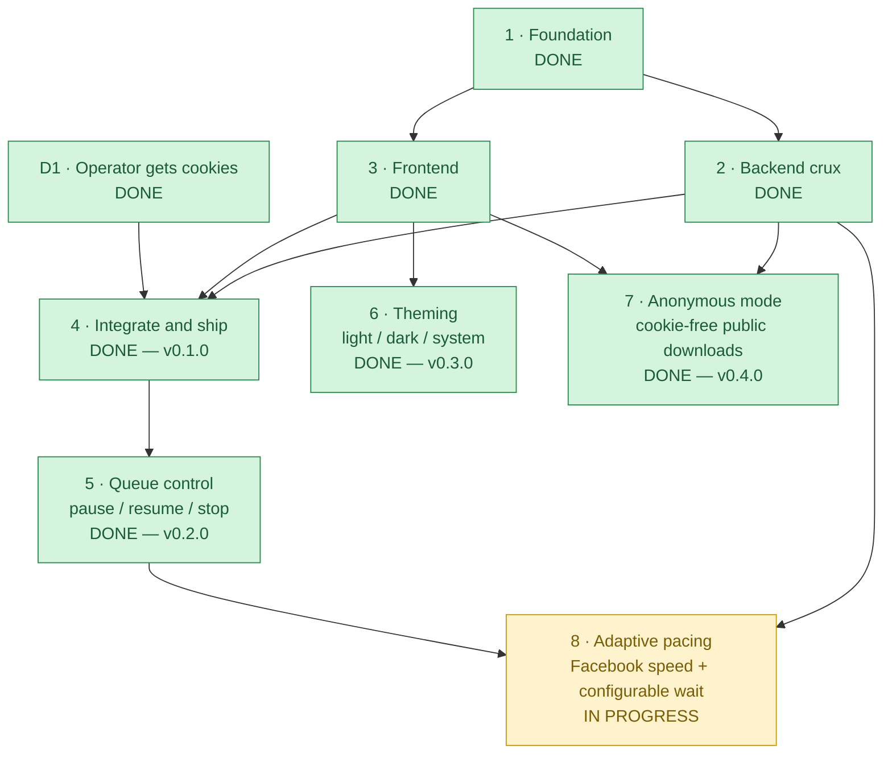

# Roadmap — gallery-dl-web

A two-service web app (FastAPI + Next.js) wrapping `gallery-dl` to download Instagram and Facebook
images with live SSE progress. See [the event contract](docs/event-contract.md) for the wire format.

## At a glance

```mermaid
flowchart TD
    P1["1 · Foundation<br/>DONE"] --> P2["2 · Backend crux<br/>DONE"]
    P1 --> P3["3 · Frontend<br/>DONE"]
    P2 --> P4["4 · Integrate and ship<br/>DONE — v0.1.0"]
    P3 --> P4
    D1["D1 · Operator gets cookies<br/>DONE"] --> P4
    P4 --> P5["5 · Queue control<br/>pause / resume / stop<br/>DONE — v0.2.0"]
    P3 --> P6["6 · Theming<br/>light / dark / system<br/>DONE — v0.3.0"]
    P2 --> P7["7 · Anonymous mode<br/>cookie-free public downloads<br/>DONE — v0.4.0"]
    P3 --> P7
    P2 --> P8["8 · Adaptive pacing<br/>Facebook speed + configurable wait<br/>IN PROGRESS"]
    P5 --> P8

    classDef done     fill:#d4f4dd,stroke:#2d8a4e,color:#1a5c33
    classDef active   fill:#fff3cd,stroke:#cc9a06,color:#7a5c04
    classDef decision fill:#fde0e0,stroke:#d05555,color:#8f2e2e

    class P1 done
    class P2 done
    class P3 done
    class P4 done
    class P5 done
    class P6 done
    class D1 done
    class P7 done
    class P8 active
```

| Phase | Status | What it is | Blocker |
|---|---|---|---|
| **1 · Foundation** | ✅ DONE | Public repo `lumduan/gallery-dl-web`; monorepo scaffold (backend from `python-template` + Next.js); both Dockerfiles; `.gitignore`/LICENSE/README; pinned SSE event contract (`docs/event-contract.md`) | — |
| **2 · Backend crux** | ✅ DONE | gallery-dl subprocess worker (STDIN config → JSON-lines hooks), asyncio `JobManager` (fan-out + history replay), SSE route, cookie store, settings/files/health routes; ruff/mypy clean, pytest **89.8%** coverage | — |
| **3 · Frontend** | ✅ DONE | Next.js pages: `/` (URL input + platform detect), `/jobs/[id]` (SSE progress + zip), `/settings` (cookies), `/downloads`; `EventSource` consumer; catch-all `/api/*` proxy route. typecheck + lint + build green | — |
| **4 · Integrate and ship** | ✅ DONE | `docker-compose` (dev + prod + host-dir overlay); ghcr publish workflow; **live E2E verified** (real cookies, 1423 files across 3 profiles); **`v0.1.0` tagged 2026-07-23** → first ghcr publish | — |
| **5 · Queue control** | ✅ DONE | `/queue` tab listing active + recent jobs; per-job **pause (SIGSTOP + slot release) / resume (SIGCONT) / stop (terminal `cancelled`)**; stop reconciles the profile's `metadata.json`; **`v0.2.0` tagged 2026-07-23** | — |
| **6 · Theming** | ✅ DONE | **System / Light / Dark** from the navbar menu or **Settings → Appearance**; System follows the OS live via DaisyUI's `--prefersdark`, an explicit choice persists in `localStorage` and is applied pre-paint by an inline `<head>` script. Removed the create-next-app boilerplate that had the app hard-locked to light; **`v0.3.0` tagged 2026-07-24** | — |
| **7 · Anonymous mode** | ✅ DONE | Cookies are now **optional**: no cookies stored → the job runs logged-out instead of being refused, and `options.anonymous` forces that even when cookies exist. Anonymous IG switches to gallery-dl's `graphql` API and drops auth-only `include` categories; a login wall is classified as `reason: login-required` instead of a traceback. `missing-cookies` retired from the event contract. Five CI gates green (**90.4%** coverage); **live E2E 2026-08-16** — 9 real files off a public FB page with zero cookies; **`v0.4.0` tagged 2026-08-16** | — |
| **8 · Adaptive pacing** | 🚧 IN PROGRESS | Facebook was ~5.5 s of sleep **per image** (one HTML page per photo) against Instagram's ~0.3 s (~30 posts per request). Pacing is now **adaptive**: start at a floor, back off only on evidence, and raise the floor as a run gets long. Configurable in three places — env, **Settings → Download pacing** (no restart), and per job. Facebook also drops `albums` from the default `include`, gains an opt-in *quick update*, and bounds gallery-dl's 122 s fallback stall | Live throughput measurement on a real profile |
| **D1 · Operator cookies** | ✅ DONE | Real IG `sessionid` + FB cookies in use; live downloads confirmed 2026-07-23 | — |

> **Phase 8 (adaptive pacing) is in progress**; the last release is `v0.4.1`. Everything before it
> is complete. (`v0.1.0` shipped phase 4, `v0.2.0`
> phase 5, `v0.3.0` phase 6, `v0.4.0` phase 7). Live E2E passes against real Instagram and Facebook
> profiles, and both images publish to ghcr on tag. Note that Facebook rate-limits an account after a
> few hundred images in one run ("temporarily blocked from viewing images"); that is a platform
> limit, not a defect, and the job reports it verbatim.
>
> **Phase 7 (anonymous mode) shipped in `v0.4.0`.** Live-verified 2026-08-16: a public Facebook page
> downloaded 9 real images with no cookies stored at all.
>
> ⚠️ **Anonymous Instagram is materially weaker than anonymous Facebook, and that is a platform
> limit, not a defect.** **Treat anonymous mode as a Facebook-first capability**; for Instagram,
> cookies remain the practical answer. Measured against live Instagram on 2026-08-16, logged-out:
>
> | Endpoint | gallery-dl uses it as | Anonymous result |
> |---|---|---|
> | `web/search/topsearch` | user-strategy `search` (default #1) | 401 |
> | `GET /<username>` | user-strategy `web` (default #2) | 200, but no `"profile_id"` to scrape |
> | `api/v1/users/web_profile_info` | user-strategy `info` (**not** in the default list) | 200, real data |
> | `graphql user_feed` | `api: graphql` listing | 400 |
> | `api/v1/feed/user/<id>/` | `api: rest` listing | 200 but `"require_login":true`, 0 items |
> | `graphql media` / `api/v1/media/<id>/info/` | single post | 401 / 302 |
>
> So a username *can* be resolved anonymously (via the unused `info` strategy), but **listing posts
> is walled on every path gallery-dl uses** — no configuration makes anonymous IG download.
> ⚠️ This also corrects the reasoning behind the `api: graphql` switch: it was chosen from reading
> gallery-dl's source on the belief that REST 401s logged-out. It does not — REST returns a
> *200-shaped* refusal. graphql is no better than the default and turns a single-post 302 into a
> 401. **The switch is still in the code and is a known open question**, deliberately left alone
> rather than changed without a decision.
>
> Remaining backlog, unchanged: multi-account cookie storage, and resuming a blocked Facebook run
> from gallery-dl's `&setextract` URL. (Job cancellation from the UI shipped in phase 5.)

---

## Phase detail

### 1 · Foundation — ✅ DONE
Monorepo created from `lumduan/python-template` conventions (uv, src-layout, hatchling, py312, ruff,
mypy-strict, pytest ≥80%). Next.js 16 + Tailwind v4 + DaisyUI 5 frontend. Both Dockerfiles
(non-root UID 1001, HEALTHCHECK). SSE contract pinned so backend and frontend could proceed
independently.

### 2 · Backend crux — ✅ DONE
- `gallerydl/worker.py` — subprocess entry: reads JSON config from STDIN, runs gallery-dl's
  in-process API (`DownloadJob` + hooks), emits JSON-lines events; always emits a terminal event.
- `gallerydl/config_builder.py` — pure translator (job payload → `config.set` tree), highest-tested.
- `jobs/manager.py` — asyncio orchestrator: per-job subprocess, history-replay SSE fan-out,
  synthesized terminal on silent worker death, GC of old terminal jobs.
- `cookies/store.py` — single-account, 0600, Netscape parser, log masking.
- **Tests**: ruff clean, `mypy src` clean, 71 tests passing at 89.8% coverage (incl. a real
  worker-subprocess integration test).

### 3 · Frontend — ✅ DONE
- `src/app/api/[...path]/route.ts` proxies `/api/*` → backend, reading `BACKEND_URL` at **request**
  time (not `next.config` rewrites, which bake the destination in at build time). CORS is still
  configured for direct backend use.
- `JobProgress.tsx` consumes the SSE stream with typed listeners; renders a live activity log and
  per-file counts; surfaces a clear "missing-cookies → Settings" message.
  ➡️ **SUPERSEDED BY PHASE 7** — `missing-cookies` no longer exists; the equivalent message is now
  the `login-required` branch, reached only when a run actually hits a wall.
- Cookie forms never display stored values (booleans only).

### 4 · Integrate and ship — ✅ DONE
- [x] `docker-compose.yml` (prod, builds from source) + `docker-compose.dev.yml` (hot-reload overlay)
- [x] GitHub Actions: `ci.yml` (backend + frontend quality), `docker-publish.yml` (ghcr on tag),
      `security.yml` (weekly bandit + pip-audit)
- [x] Both images build; full pipeline smoke-tested end-to-end (frontend → catch-all proxy →
      backend → worker subprocess → gallery-dl → JSON-lines → SSE → frontend), verified with a
      fake cookie (job correctly reaches `failed/dl-failed` on the auth wall)
- [x] `docker-compose.hostdir.yml` — opt-in overlay to bind-mount a host/NAS directory for media
      (setting `DOWNLOADS_DIR` alone does nothing; the path must also exist inside the container)
- [x] Stall detection reworked into two independent deadlines (liveness vs progress) after the
      original 90 s single deadline was found killing healthy jobs mid-enumeration
- [x] live download E2E with **real** cookies — 1423 files / 0.84 GB across 3 profiles
- [x] tag `v0.1.0` (2026-07-23) → first ghcr publish, under the original package names
      `ghcr.io/lumduan/gallery-dl-web-{backend,frontend}:{latest,v0.1.0}`. Those packages were
      later deleted (see the rename in phase 5), so **no `v0.1.0` image is published today** —
      build it from the tag, or use `v0.2.0`.

### 5 · Queue control — ✅ DONE
Prompted by a live incident: two large profiles held both concurrency slots for hours, two more sat
at `queued` with no explanation, and a browser refresh lost the only link to a running job.
- [x] `/queue` tab — active (running / paused / queued, with "waiting — N ahead") + recent jobs,
      polling `GET /api/jobs`; `GET /api/jobs?active=1` for the active filter
- [x] `POST /api/jobs/{id}/{pause,resume,cancel}` (404 unknown, 409 wrong state)
- [x] **Pause = SIGSTOP + hand the concurrency slot back**, so a waiting profile starts at once;
      resume re-acquires a slot then SIGCONTs, continuing the same profile walk with no
      re-enumeration. Paused wall-time is subtracted from every stall clock.
- [x] **Stop = terminal `cancelled`** (not `failed`) — fetched files kept and `metadata.json`
      reconciled immediately, via `media_paths()` so an all-skipped run still reconciles
- [x] `PAUSE_MAX_SECONDS` (default 2 h) auto-stops a job left paused, so a suspended worker can't
      be leaked
- [x] 19 new backend tests (150 total, 90% coverage); frontend lint + typecheck + build green
- [x] tag `v0.2.0` (2026-07-23) → ghcr publish of
      `ghcr.io/lumduan/gallery-dl-web/{backend,frontend}:{latest,v0.2.0}`
- [x] published images **renamed** from `gallery-dl-web-{backend,frontend}` to the nested
      `gallery-dl-web/{backend,frontend}`. A privacy fix required deleting and recreating the
      GitHub repo (see the note below), which orphaned the original ghcr packages: each still holds
      an internal link to the deleted repository, so the workflow's `GITHUB_TOKEN` can no longer
      push to them (`permission_denied: write_package`) and the recreated repo cannot be attached —
      the package settings page will not offer a repo whose id differs from the stale link. A
      package name that never existed has no such link and is created correctly by the workflow
      itself. The orphaned packages were then deleted, so the only published images are
      `ghcr.io/lumduan/gallery-dl-web/{backend,frontend}:{latest,v0.2.0}` — `v0.1.0` has no
      published image and must be built from its tag.

> **Note on the repository history.** `test_errors.py` was originally committed with a real
> Facebook username and that person's photo/album ids pasted in as "verbatim" stderr. All of it was
> purged with `git-filter-repo`, and because GitHub keeps unreachable objects addressable by SHA
> after a force-push, the repository was deleted and recreated to guarantee removal. The published
> container images never contained the data — `backend/Dockerfile` copies only `src/`. See the
> sanitizing rule in `CLAUDE.md` under testing conventions.

### 6 · Theming — ✅ DONE
A **System / Light / Dark** menu on the navbar. Two pieces of `create-next-app` boilerplate had the
app hard-locked to light and had to go first: `<html data-theme="light">` in `layout.tsx` pinned the
DaisyUI theme, and an **unlayered** `body { background: var(--background) }` in `globals.css`
outranked everything in Tailwind's `@layer utilities`, making the `bg-base-200` already on `<body>`
dead code. Neither was visible while the app was light-only.
- [x] **"System" is the absence of `data-theme`.** DaisyUI emits `--prefersdark` as
      `@media (prefers-color-scheme: dark) { :root:not([data-theme]) { … } }`, so leaving the
      attribute off hands the palette *and* `color-scheme` to CSS — a live OS change is picked up
      with no `matchMedia` listener anywhere.
- [x] No flash: an inline `<head>` script (`THEME_INIT_SCRIPT` in `lib/theme.ts`) re-applies a
      stored light/dark choice during HTML parsing, per Next's own
      *preventing-flash-before-hydration* guide; `<html>` carries `suppressHydrationWarning`.
- [x] `ThemeToggle.tsx` holds **no React state** — all three modes are distinguishable in CSS, so
      the trigger's sun/moon and the menu's ✓ are correct before hydration too. Nothing to mismatch.
- [x] Two controls, one mechanism: the navbar menu and a **Settings → Appearance** card
      (`ThemeSetting.tsx`) share `THEME_OPTIONS`' marker classes, so each reflects a change made in
      the other with no state to keep in step. The navbar owns the single cross-tab listener,
      because it is the one mounted on every page.
- [x] The **extension popup** carries the same three modes (`extension/theme.js`). Two constraints
      shape it: MV3's `script-src 'self'` means the pre-paint script must be an external file, and
      `chrome.storage.local` is async — awaiting it flashes the whole 320px window — so the
      preference lives in synchronous `localStorage` instead. Separate origin, so separate setting.
- [x] Zero component changes: every color in the app was already a DaisyUI semantic token.
- [x] Verified headlessly across 4 states (system×light-OS, system×dark-OS, forced dark, forced
      light) — attribute, `color-scheme`, resolved background and the visible icon/✓ all asserted;
      frontend lint + typecheck + build green
- [x] tag `v0.3.0` (2026-07-24) → ghcr publish of
      `ghcr.io/lumduan/gallery-dl-web/{backend,frontend}:{latest,v0.3.0}`
- [x] tag `v0.3.1` (2026-07-24) → the Settings → Appearance card, a second surface for the same
      preference; patch rather than minor because nothing about the mechanism changed

### 7 · Anonymous mode — ✅ DONE
Cookies were mandatory at three layers; that framing was wrong for public content. gallery-dl 1.32.7
does support logged-out extraction — `InstagramExtractor.login()` sets `_logged_in = False` and the
extractors branch on it, Facebook declares no `cookies_names` at all, and `_init_cookies` is guarded
by `if cookies := self.config("cookies")`, so an absent cookie is a no-op rather than an error.

- [x] `missing-cookies` **retired**. `_run_job` falls back to an anonymous run instead of refusing;
      `options.anonymous` forces one even when cookies are stored (so a public profile need not
      spend a real session). `anonymous` is a top-level worker-payload key beside `cookies`.
- [x] `config_builder`: `cookies` set to `None` when anonymous, still *before* the defaults loop so
      an `options` key cannot overwrite it. `include` now resolved once via `_resolve_include` —
      the avatar block appends to that result, which is what stops the filtering being undone.
- [x] Anonymous-Instagram tuning: `api: graphql`, and `stories` / `highlights` / `saved` /
      `collection` stripped from `include` (logged-out they `AbortExtraction` and kill the walk).
      Facebook needs neither.
- [x] `errors.py:detect_login_wall` → `reason: login-required` with a plain-language message and a
      Settings link, checked **after** `detect_rate_limit` (FB's block page reads login-ish, and
      "wait" is the right advice there, not "re-export cookies").
- [x] UI: per-job checkbox + a pre-submit hint when the platform has no cookies stored; an
      `anonymous` badge on `/queue` and the job page; Settings and the form footer no longer claim
      cookies are required.
- [x] Docs: event contract (reason enum + new rule 11), README, CLAUDE.md invariants.
- [x] Tests: 169 passing, 90.4% coverage; new autouse `_no_real_spawn` fixture, because removing the
      cookie pre-flight also removed the accidental guard that kept cookie-less tests from spawning
      a real worker.
- [x] **Live E2E (2026-08-16)** — not provable by the suite, which monkeypatches `DownloadJob` and
      never touches the network:
      - public **Facebook** page, no cookies stored → **9 real images downloaded**, profile name
        resolved, files on disk. This is the headline result.
      - **Instagram** logged-out → `401 Unauthorized` from the GraphQL endpoint. Correctly surfaced
        as `login-required` with a Settings link. The `graphql` switch was confirmed in the
        traceback (the failing URL is `/graphql/query/`, not the REST `/api/v1/` path), so the
        tuning does take effect — Instagram simply refuses anonymous callers.
      - **This run is what added the bare-`401` pattern to `detect_login_wall`.** Real Instagram
        never emits gallery-dl's `AuthRequired` prose, so the prose-only classifier written from
        reading the source missed the single most likely anonymous failure. Worth remembering: the
        error text a platform *actually* returns is not the text its client library defines.
      - UI verified headless in light and dark: checkbox, the "no cookies stored → will run
        anonymously" hint, `anonymous` badges, and the `login-required` alert.
- [x] tag `v0.4.0` (2026-08-16) → ghcr publish of
      `ghcr.io/lumduan/gallery-dl-web/{backend,frontend}:{latest,v0.4.0}`
- [x] **`v0.4.1` (2026-08-16) — the classifier fix the first live user report exposed.** An
      anonymous IG profile job still surfaced a raw traceback: `detect_login_wall` matched only
      gallery-dl's `AuthRequired` prose, which **real Instagram never emits**. What it actually
      sends is a urllib3 debug line `… HTTP/1.1" 401 42` — status then *content length*, so the
      word "Unauthorized" is nowhere on it — plus HTTP-200-with-`require_login` bodies. Both now
      match, and `detect_login_wall` gained an `anonymous` flag so gallery-dl's generic
      `NotFoundError: Requested user could not be found` counts as a wall only when there was no
      session (with cookies it can be a genuinely deleted account).
      ⇒ **The lesson worth keeping: match the text the platform actually returns, not the text the
      client library defines.** The prose patterns were written from the source and looked right.

### 8 · Adaptive pacing — 🚧 IN PROGRESS
Prompted directly by an operator report: *Facebook download time is a problem, it is too slow.*

The cause was not that Facebook throttles harder — it is that **gallery-dl fetches one full
1-3 MB HTML page per photo** (`facebook.py:extract_set` walks a singly-linked list of ids, so it
cannot be batched, cursored or parallelised), while Instagram gets ~30 posts from a single JSON
request. The same `sleep-request` therefore cost Facebook **~5.5 s per image** and Instagram
**~0.3 s**. gallery-dl itself ships Facebook with *no* pacing at all; the 3-8 s was ours, added
after Facebook blocked an account at ~767 images.

- [x] `gallerydl/pacing.py` — an adaptive pacer that hands gallery-dl a delay rather than sleeping
      itself (gallery-dl already credits time spent working against the interval, so a 1 s floor
      against a 1-2 s page fetch usually adds nothing at all).
- [x] **Sensors where they can actually see.** A `requests` response hook rather than the return
      value of `Extractor.request`, because only the hook sees intermediate retries, redirect hops
      and image downloads — a CDN 429 was otherwise invisible. Plus a root log handler, because
      **on Facebook a rate limit is an HTTP 200**: a soft block is a photo page whose image URL
      will not parse, and gallery-dl's own warning is the only in-band evidence.
- [x] **A volume ramp, which is the half that actually prevents a block.** A hard block is terminal
      by design (`photo_page_request_wrapper` raises `AbortExtraction`), so reacting to one is
      pointless. The floor instead rises with cumulative requests: 1 s → ~4.8 s by request 767,
      8 s ceiling at ~1400. Short profiles stay fast; long ones end up *more* careful than the old
      fixed 3-8 s ever was.
- [x] Three config surfaces: `<PLATFORM>_PACING_MODE`/`_SLEEP_REQUEST_MIN`/`_MAX`,
      **Settings → Download pacing** (a `pacing.json` store read at job-build time, so a
      rate-limit response needs no restart), and per-job *Advanced options* on the form.
      `MIN`/`MAX` change meaning with the mode; `fixed` restores the previous behaviour exactly.
- [x] Two Facebook structural wins: `include` defaults to `photos` (an album re-walks pages the
      main set already covered, and the archive is only consulted *after* the page is fetched), and
      an opt-in **quick update** that stops after N consecutive already-downloaded files.
- [x] Bounded the 122 s fallback stall (`fallback-retries: 1`, `sleep-429` **shaped** rather than
      flattened — `downloader/http.py` inherits it for CDN 429s). Two consecutive unparseable
      photos previously exceeded `stall_floor_seconds` on their own and got a healthy job killed.
- [x] New `pacing` SSE event, emitted on change only and hard-capped, because `JobState.events` is
      a bounded deque the zip route reads `file` events back out of.
- [x] Four pre-existing bugs fixed on the way: `MAX=0` never actually disabled pacing; a stale
      `backend/.env.example`; a `sleep_request` / `sleep-request` docstring mismatch; and
      `errors.py` advice that adaptive pacing made obsolete.
- [x] 242 backend tests at **91.1%** coverage; new `tests/gallerydl/conftest.py` guards that
      worker-side tests never make a real request and never leave gallery-dl's `Extractor` patched.
- [x] **Live verification** — the same job under both modes against a real Facebook URL:
      `fixed 3-8` slept **4.68 s** per request, `adaptive` slept **1.01 s**. UI driven headless in
      light and dark: the Settings card, its mode-dependent labels, the custom badge and reset, and
      the platform-aware advanced block, with no console errors.
- [ ] **Remaining: throughput on a real profile.** The per-request delay is measured; images/minute
      end-to-end on a large public page is not, and that is the number the operator actually cares
      about.

### D1 · Operator cookies — ✅ DONE
- **Primary (new): browser extension** — load `extension/` unpacked, set the server URL, click
  *Send Instagram session* / *Send Facebook cookies* while logged in. One-click refresh when the
  session rotates. (Shipped as a follow-up after v0.1; feeds the same `PUT /api/settings/cookies`
  endpoint as manual paste — no backend change.)
- **Fallback: manual paste** — IG: DevTools → Application → Cookies → copy `sessionid`. FB: export
  Netscape `cookies.txt` (use a burner account).

---

## Living-document rule

Any task that closes or materially advances a tracked item **must** reconcile this document —
including the at-a-glance diagram and the phase-status table — as part of its own completion, not as
a follow-up. This is the roadmap-specific instance of "keep durable planning docs current as part of
'done'."
